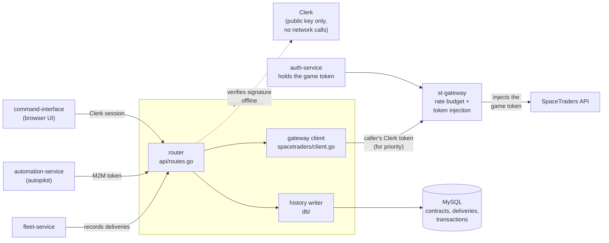
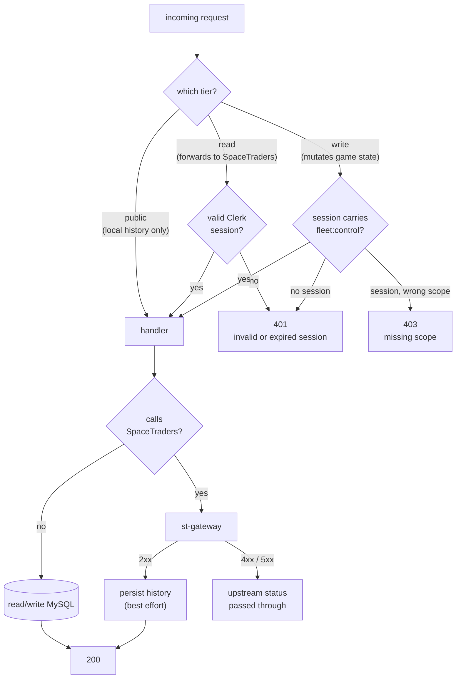
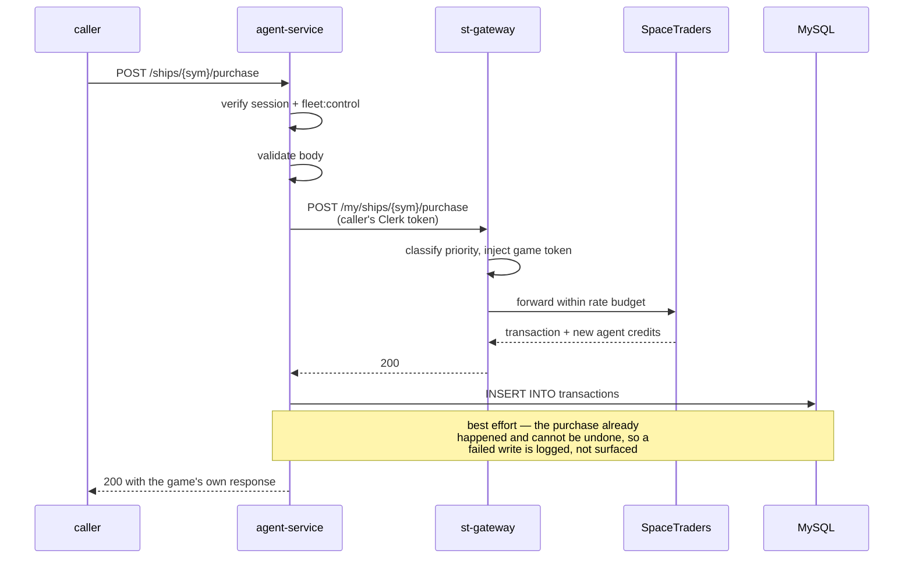

# Agent Info Service

The agent's view of itself: profile, fleet, contracts — and the actions that move credits.

Everything the service reads lives on SpaceTraders, not here. It holds **no game credential
of its own** and never handles one. That single fact explains most of the design — including
why the read routes need a signed-in session but no particular permission (there is no
credential to scope access to), and why the two history endpoints need no session at all
(they never touch SpaceTraders).

The credential itself no longer travels with the request. st-gateway holds it — fetched from
auth-service — and injects it on every upstream call, so this service never sees a game token
at all. What it forwards to st-gateway instead is the caller's own Clerk session, which is how
a browser request keeps its interactive priority across the hop.

What the service *does* keep is history. Ship purchases, cargo purchases and cargo sells are
the actions that spend or earn credits, so they are owned here rather than in fleet-service,
and each one is written to a local MySQL transaction log after the game confirms it. Contract
accepts, fulfils and deliveries are recorded the same way.

## Architecture



Clerk appears as a dotted edge because there is no call to it. The service is given Clerk's
RSA public key at startup and verifies session tokens locally; a Clerk outage cannot take this
service down.

## How a request is decided

Every route falls into exactly one of three access tiers. The tier is declared at the router,
not inside the handler, so `SetUpRouter` reads as the authorization policy.



The verified session is then forwarded to st-gateway, which uses it to classify the request's
priority — not to authenticate it. The SpaceTraders credential is st-gateway's own.

## A credit-moving action, end to end

Purchases and sells are the only flows where a failure has to be reasoned about carefully,
because the game state changes before the history row is written.



## Running it

### Prerequisites

* Go (see `src/go.mod` for the version)
* Docker, for the MySQL container
* A Clerk RSA public key — **the service refuses to start without one.** A service that can
  boot with authentication silently off is worse than one that doesn't boot.

### Local development

```bash
export CLERK_JWT_KEY="$(cat /path/to/clerk-public-key.pem)"   # or CLERK_JWT_KEY_FILE=/path/to/key.pem
docker compose up -d mysql                                     # MySQL on :3306

cd src
MYSQL_HOST=127.0.0.1 MYSQL_USER=user MYSQL_PASSWORD=pass PORT=8080 go run .
```

`PORT` matters: the service defaults to port 80 to match its deployment, and binding 80
requires root. Set `PORT=8080` (or anything above 1024) to run it as yourself.

To run the whole stack in containers instead, export the same `CLERK_JWT_KEY` and run
`docker compose up` — compose passes it through. The app is published on `localhost:8080`.

Check it is alive, then call a real route:

```bash
curl localhost:8080/health
curl localhost:8080/api/agent/v1/agent \
  -H "Authorization: Bearer <clerk-session-jwt>"
```

Swagger UI: `http://localhost:8080/api/agent/swagger/index.html`. Regenerate it after changing
any handler annotation:

```bash
cd src && swag init -g app-runner.go --parseInternal --output ./docs
```

### Tests

```bash
cd src
go test ./...                      # fast
go test ./... -race -shuffle=on    # what CI runs
```

No database or network is needed: the DB layer is exercised through a mock driver and the
gateway through a stub HTTP server.

## API

Base path `/api/agent/v1`. Operational routes sit outside the version prefix on purpose —
they are not part of the resource API's compatibility surface.

| Method | Path | Tier | Notes |
|---|---|---|---|
| GET | `/health` | public | Also mounted at `/api/agent/health`, because production's CloudFront only routes paths matching a configured pattern |
| GET | `/api/agent/swagger/` | public | Swagger UI |
| GET | `/current-agent` | read | Bundle of agent + ships + contracts in one call |
| GET | `/agent` | read | |
| GET | `/ships` | read | |
| GET | `/ships/{shipSymbol}` | read | |
| GET | `/contracts` | read | |
| GET | `/contracts/{contractId}` | read | |
| POST | `/contracts/{contractId}/accept` | write | Persists the resulting contract state |
| POST | `/contracts/{contractId}/fulfill` | write | Persists the resulting contract state |
| POST | `/ships/purchase` | write | Body `{ shipType, waypointSymbol }`; records a `SHIP_PURCHASE` |
| POST | `/ships/{shipSymbol}/purchase` | write | Body `{ symbol, units }`; records a `PURCHASE` |
| POST | `/ships/{shipSymbol}/sell` | write | Body `{ symbol, units }`; records a `SELL` |
| POST | `/contracts/{contractId}/deliveries` | public | Internal; called by fleet-service after a successful deliver-contract |
| GET | `/contracts/{contractId}/deliveries` | public | Oldest first |
| GET | `/transactions` | public | Newest first; `shipSymbol`, `type`, `limit` filters |

**Tiers:** `public` needs nothing. `read` needs a valid Clerk session (any scope, or none).
`write` additionally needs the `fleet:control` scope.

### `GET /transactions` parameters

| Parameter | Type | Default | Behaviour |
|---|---|---|---|
| `shipSymbol` | string | — | Exact match; omitted means no filter |
| `type` | enum | — | One of `SHIP_PURCHASE`, `PURCHASE`, `SELL`. Anything else is a `400`, not an empty list |
| `limit` | int | 100 | Must be a positive integer, otherwise `400`. Capped at 1000 |

### Error responses

| Status | Body shape | Raised by |
|---|---|---|
| 400 | `text/plain` | Malformed body, missing required field, bad query parameter |
| 401 | `{"error":{"message":…}}` | No, invalid or expired Clerk session |
| 403 | `{"error":{"message":…}}` | Valid session without `fleet:control` |
| 4xx/5xx | `text/plain` | Passed through from SpaceTraders with its own status |
| 500 | `text/plain` | A history read failed |
| 502 | `text/plain` | The gateway was unreachable or timed out |

The auth tier answers in JSON; everything downstream of it uses `http.Error`'s plain text.
That inconsistency is deliberate for now — see known limitations.

## Configuration

| Variable | Default | Purpose |
|---|---|---|
| `CLERK_JWT_KEY` | — | Clerk's RSA public key, inline. Literal `\n` sequences are unescaped, so it survives being passed through SSM |
| `CLERK_JWT_KEY_FILE` | — | Path to the same key as a PEM file. Used only when `CLERK_JWT_KEY` is unset; an empty file is an error |
| `CLERK_ISSUER` | — | When set, session tokens must carry this `iss`. Unset means the claim is not checked |
| `ST_GATEWAY_URL` | `http://localhost:3002` | st-gateway's base address; `/proxy` is appended. Read once at startup |
| `CORS_ALLOWED_ORIGIN` | `http://localhost:3000` | The single frontend origin allowed to call this service |
| `PORT` | `80` | Listen port |
| `MYSQL_HOST` | `mysql` | |
| `MYSQL_PORT` | `3306` | |
| `MYSQL_USER` | `root` | |
| `MYSQL_PASSWORD` | `example` | Special characters are safe — the DSN is built through the driver's own config, not string formatting |
| `MYSQL_DATABASE` | `vnm-agent-db` | |

Exactly one of `CLERK_JWT_KEY` / `CLERK_JWT_KEY_FILE` is required. Everything else has a
working default.

### Tunable values

These are compile-time constants rather than environment variables, because none of them has
ever needed to differ between environments.

| Constant | Value | Where | What it bounds |
|---|---|---|---|
| `requestTimeout` | 30s | `spacetraders/client.go` | A single upstream call |
| `maxErrorBody` | 64 KiB | `spacetraders/client.go` | How much of a failing upstream response is quoted back |
| `maxBodyBytes` | 1 MiB | `api/routes.go` | An inbound request body |
| `defaultTransactionLimit` | 100 | `api/routes.go` | `GET /transactions` page size |
| `maxTransactionLimit` | 1000 | `api/routes.go` | The ceiling a caller can ask for |
| `readHeaderTimeout` / `readTimeout` | 10s / 30s | `app-runner.go` | Slow inbound clients |
| `idleTimeout` | 120s | `app-runner.go` | Keep-alive connections |
| `connMaxLifetime` | 3m | `db/db.go` | Connection recycling, well inside MySQL's `wait_timeout` |
| `maxOpenConns` | 10 | `db/db.go` | Pool size |
| `pingAttempts` × `pingDelay` | 15 × 2s | `db/db.go` | How long startup waits for MySQL |

## Storage

Three tables, created and migrated on every boot. `Migrate` is idempotent: it consults
`information_schema` before widening a column or adding an index, so a boot against an
up-to-date database issues no DDL beyond `CREATE TABLE IF NOT EXISTS`.

| Table | Written by | Read by |
|---|---|---|
| `contracts` | accept / fulfill contract | nothing yet — kept for later reporting |
| `contract_deliveries` | `POST .../deliveries` (fleet-service) | `GET .../deliveries` |
| `transactions` | ship purchase, cargo purchase, cargo sell | `GET /transactions` |

Money columns are `BIGINT`. A late-game agent's credit balance passes `INT`'s ceiling of
2,147,483,647, at which point MySQL in strict mode rejects the insert and in non-strict mode
silently clamps it.

Both ends of the connection are pinned to UTC. MySQL converts `TIMESTAMP` columns to the
session time zone on the way in and back out, so without that pinning every recorded time
round-trips to a different instant.

## Credentials

Two things travel, and neither is a game token.

| | Carries | Checked by | Used for |
|---|---|---|---|
| `Authorization` (inbound) | The caller's Clerk session, or an M2M token for a machine caller | This service, offline against Clerk's public key | Deciding the access tier |
| `Authorization` (outbound to st-gateway) | The same token, re-emitted after verification | st-gateway, offline | Priority class only — st-gateway injects its own SpaceTraders credential |

st-gateway grants the interactive lane only to a human Clerk session (`sub` prefixed `user_`);
a machine token (`mch_`) and anything unverifiable get background. Forwarding the caller's token
rather than one of this service's own is what preserves that distinction: a browser request stays
interactive, and automation-service's background traffic stays background.

`X-SpaceTraders-Token` and `X-Priority` are gone. This service ignores both. They remain on the
CORS allow-list only because command-interface still sends them, and a header a browser sends
that is not on that list fails preflight — which would block the request outright. They come off
once the frontend stops sending them.

## Known limitations

Things this implementation deliberately does not do, and honest gaps.

* **`POST /contracts/{contractId}/deliveries` is unauthenticated.** It is described as an
  internal fleet-service call, but it is exposed through the same public ingress as everything
  else and it *writes*. Anyone who can reach the service can fabricate delivery rows. The
  "public tier" rationale it inherited covers reads that never touch SpaceTraders; it does not
  cover a write. Closing this needs a matching change in fleet-service, so it is called out
  here rather than changed unilaterally.
* **History writes are best-effort.** A purchase that succeeds upstream but fails to persist
  returns 200 and logs the failure. The game state cannot be rolled back, so the history is
  allowed to be incomplete; there is no retry, no outbox, and no reconciliation job.
* **`GET /current-agent` makes three sequential upstream calls.** They could run concurrently,
  but running them in series keeps this endpoint's footprint in st-gateway's shared rate budget
  predictable. Worst-case latency is three times the single-call timeout.
* **Error bodies are not one shape.** Auth rejections are JSON; validation and upstream errors
  are plain text. Unifying them would change the wire format for existing consumers.
* **`X-SpaceTraders-Token` and `X-Priority` are still on the CORS allow-list** despite being
  ignored, because command-interface still sends them and an unlisted header fails preflight.
  They come off once the frontend stops sending them.
* **`contracts` is written but never read.** It is populated on accept and fulfil against a
  reporting need that does not exist yet.
* **Migrations run at startup with no locking.** Two instances booting simultaneously against a
  fresh database can race on `CREATE INDEX`. In practice this deployment runs one instance.
* **`TIMESTAMP` columns stop working in 2038.** Not a concern for a game service, noted so the
  choice is a choice.
* **`CLERK_ISSUER` is optional.** Left unset, the `iss` claim is not checked; the signature
  check still constrains tokens to the configured Clerk instance.
* **The MySQL DDL is not covered by an automated test against a real server.** Migration
  *sequencing* is tested through a mock driver, but the SQL dialect itself is verified only by
  running the service.

## References

* SpaceTraders API — https://spacetraders.stoplight.io/docs/spacetraders/11f2735b75b02-space-traders-api
* Go web basics — https://gowebexamples.com/
