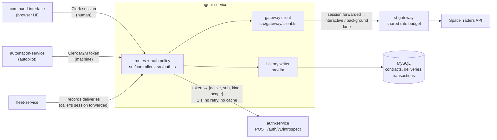
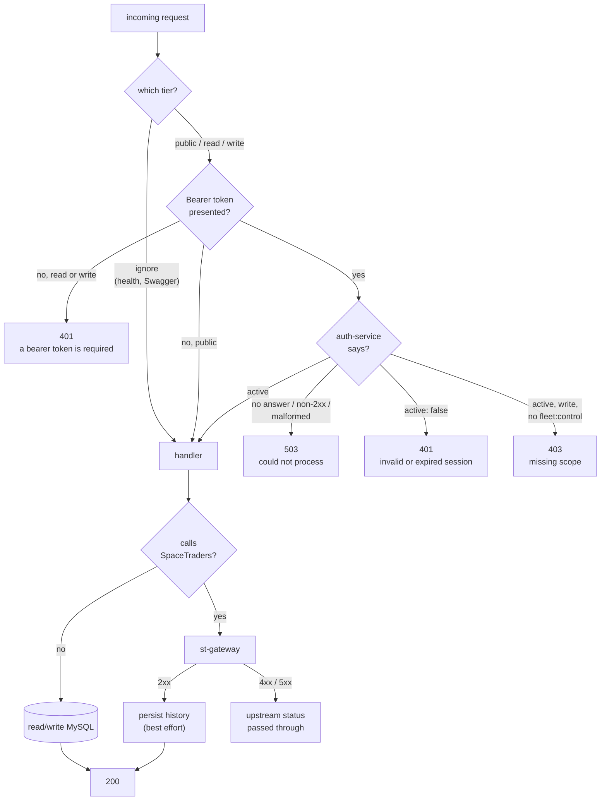
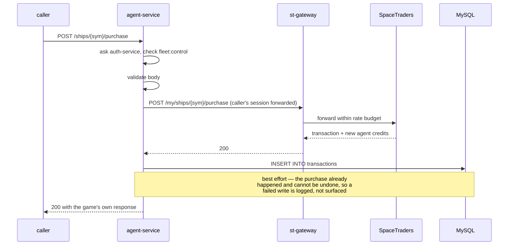

# Agent Info Service

The agent's view of itself: profile, fleet, contracts — and the actions that move credits.

Everything the service reads lives on SpaceTraders, not here. It holds **no game credential
of its own**: the caller sends their own SpaceTraders token on every request and the service
forwards it upstream verbatim and forgets it. That single fact explains most of the design —
including why the read routes need a signed-in session but no particular permission (an
anonymous caller has nothing to read regardless), and why the two history endpoints need no
session at all (they never touch SpaceTraders).

What the service *does* keep is history. Ship purchases, cargo purchases and cargo sells are
the actions that spend or earn credits, so they are owned here rather than in fleet-service,
and each one is written to a local MySQL transaction log after the game confirms it. Contract
accepts, fulfils and deliveries are recorded the same way.

## Architecture


```mermaid
flowchart LR
    browser["command-interface<br/>(browser UI)"]
    autopilot["automation-service<br/>(autopilot)"]
    fleet["fleet-service"]

    subgraph this["agent-service"]
        router["routes + auth policy<br/>src/controllers, src/auth.ts"]
        client["gateway client<br/>src/gateway/client.ts"]
        store["history writer<br/>src/db/"]
    end

    gateway["st-gateway<br/>shared rate budget"]
    st["SpaceTraders API"]
    mysql[("MySQL<br/>contracts, deliveries,<br/>transactions")]
    auth["auth-service<br/>POST /auth/v1/introspect"]

    browser -->|"Clerk session<br/>(human)"| router
    autopilot -->|"Clerk M2M token<br/>(machine)"| router
    fleet -->|"records deliveries<br/>(caller's session forwarded)"| router

    router -->|"token → {active, sub, kind, scope}<br/>1 s, no retry, no cache"| auth
    router --> client
    router --> store
    client -->|"session forwarded →<br/>interactive / background lane"| gateway
    gateway --> st
    store --> mysql
```

agent-service verifies no token itself (auth-design.md decision 21). It sends the bearer it
received to auth-service, the one verifier in the fleet, and decides only what its own route
needs from the answer. The cost is stated plainly: with auth-service down, every request that
carries a token answers `503`, while anonymous reads of the history routes and health keep
working. There is no cache and no fallback to local verification, deliberately.

## How a request is decided

Every route declares its requirement in one table — `none`, `session`, a scope, or "ignore
credentials" for health and Swagger — so `routePolicy` in `src/auth.ts` reads as the authorization
policy. The policy itself is the shared `@v-m-pioneer-trading/clerk-client` package (an Express
adapter over the introspection client), pinned case by case by
[`meta/fixtures/introspection.json`](https://github.com/V-M-Pioneer-Trading/meta/blob/main/fixtures/introspection.json).

**Default-deny.** A route that answers a mutating method (anything but `GET`, `HEAD`, `OPTIONS`)
must declare a session or a scope. The service refuses to start otherwise; and a handler that reaches the router without any declaration is answered `500 this
route declares no required scope` at request time. That is what makes another unauthenticated
write like meta#71 impossible rather than unlikely. `HEAD` is registered on the same route as
`GET` and carries its requirement.


```mermaid
flowchart TD
    req["incoming request"] --> tier{"which tier?"}

    tier -->|"ignore<br/>(health, Swagger)"| handler["handler"]
    tier -->|"public / read / write"| bearer{"Bearer token<br/>presented?"}
    bearer -->|"no, public"| handler
    bearer -->|"no, read or write"| e401a["401<br/>a bearer token is required"]
    bearer -->|yes| center{"auth-service<br/>says?"}
    center -->|"no answer / non-2xx /<br/>malformed"| e503["503<br/>could not process"]
    center -->|"active: false"| e401b["401<br/>invalid or expired session"]
    center -->|"active, write,<br/>no fleet:control"| e403["403<br/>missing scope"]
    center -->|"active"| handler

    handler --> up{"calls<br/>SpaceTraders?"}
    up -->|no| db[("read/write MySQL")] --> ok["200"]
    up -->|yes| gw["st-gateway"]
    gw -->|"2xx"| persist["persist history<br/>(best effort)"] --> ok
    gw -->|"4xx / 5xx"| passthru["upstream status<br/>passed through"]
```

`Authorization` is the only credential, and it is always the Clerk session. It is verified
by auth-service, then forwarded verbatim to st-gateway, which derives queue priority from it: a human
session earns the interactive lane, automation-service's machine token queues as background
(auth-design.md decision 2). A stale caller still sending the old `X-SpaceTraders-Token`
header is served normally; the header is simply ignored.

## A credit-moving action, end to end

Purchases and sells are the only flows where a failure has to be reasoned about carefully,
because the game state changes before the history row is written.


```mermaid
sequenceDiagram
    participant C as caller
    participant A as agent-service
    participant G as st-gateway
    participant S as SpaceTraders
    participant D as MySQL

    C->>A: POST /ships/{sym}/purchase
    A->>A: ask auth-service, check fleet:control
    A->>A: validate body
    A->>G: POST /my/ships/{sym}/purchase (caller's session forwarded)
    G->>S: forward within rate budget
    S-->>G: transaction + new agent credits
    G-->>A: 200
    A->>D: INSERT INTO transactions
    Note over A,D: best effort — the purchase already<br/>happened and cannot be undone, so a<br/>failed write is logged, not surfaced
    A-->>C: 200 with the game's own response
```

## Running it

### Prerequisites

* Node 24 (`engines` in `package.json`)
* Docker, for the MySQL container
* A reachable auth-service and its introspection secret — **the service refuses to start
  without `AUTH_INTROSPECTION_URL` and `AUTH_INTROSPECTION_SECRET`.** `meta/docker-compose.yml`
  runs one on `localhost:8082` with the secret `local-dev-introspection-secret`.

### Local development

```bash
export AUTH_INTROSPECTION_URL=http://localhost:8082/auth/v1/introspect   # the FULL endpoint URL
export AUTH_INTROSPECTION_SECRET=local-dev-introspection-secret
docker compose up -d mysql                                                # MySQL on :3306

npm ci --ignore-scripts
npm run build
MYSQL_HOST=127.0.0.1 MYSQL_USER=user MYSQL_PASSWORD=pass PORT=8080 npm start
```

`PORT` matters: the service defaults to port 80 to match its deployment, and binding 80
requires root. Set `PORT=8080` (or anything above 1024) to run it as yourself.

To run the whole stack in containers instead, run `docker compose up`; compose passes
`AUTH_INTROSPECTION_URL` / `AUTH_INTROSPECTION_SECRET` through, defaulting to meta's local
auth-service on the host. The app is published on `localhost:8080`.

Check it is alive, then call a real route:

```bash
curl localhost:8080/health
curl localhost:8080/api/agent/v1/agent \
  -H "Authorization: Bearer <clerk-session-jwt>"
```

Swagger UI: `http://localhost:8080/api/agent/swagger/`. The spec is `openapi.json` (OpenAPI 3,
generated by tsoa from the controllers and committed). Regenerate it after changing a controller;
it needs no server or DB, and CI fails if it is stale:

```bash
npm run openapi
```

Syncing `openapi.json` to meta's `openapi/agent-service.json` waits for meta#26's org secrets
(`OPENAPI_SYNC_*`) to be granted to this repository; there is no sync job here yet.

### Tests

```bash
npm test                              # jest; no network needed
TEST_MYSQL_HOST=127.0.0.1 npm test    # also runs the real-MySQL integration test (what CI does)
node scripts/run-contract.js          # the black-box contract suite against this build (needs MySQL; see contract/README.md)
```

The DB layer is exercised through a fake `Sql` door, the gateway through a stub HTTP server and
auth-service through a stub centre on loopback. `contract/` is a black-box HTTP suite that starts
the built image (or process) and plays st-gateway and auth-service itself; CI runs it as the
`contract` job.

## Deploying and rolling back

CI (`.github/workflows/container.yml`) reports three required checks on every pull request:
`test` (dependency allowlist, audit, typecheck, build, spec freshness, unit tests with a real
MySQL), `contract` (the contract suite against the image) and `image` (a push-less build of the
arm64 image). A push to `main` builds and pushes
`ghcr.io/v-m-pioneer-trading/agent-service:latest` and `:sha-<40 hex>`, then redeploys through
SSM on the shared host, but only when that commit is still the tip of `main`. A `v*` tag pushes
`sha-<tip>` only: it never tags `latest` and never deploys.

Roll back (or deploy a tag's image) by sha, with the bootstrap document's `imageTag` parameter
(infrastructure README, "Rolling back a service image"):

```bash
INSTANCE_ID=i-011b6b82a9072a385
SHA=<40-hex commit sha>
aws ssm send-command --region eu-central-1 \
  --document-name "agent-service-bootstrap-$INSTANCE_ID" \
  --targets "Key=InstanceIds,Values=$INSTANCE_ID" \
  --parameters imageTag=sha-$SHA --timeout-seconds 600 \
  --query Command.CommandId --output text
```

A rollback is not sticky: the next merge to `main`, or a `terraform apply` that changes the
document, redeploys `:latest`. Follow a rollback with a revert PR on `main` before anything else
merges there, and check that `main`'s CI deploy is idle first. The MySQL schema is the one the
earlier Go implementation used, unchanged, so a rollback across the cutover needs no data change.

A memory cap for the container (`--memory` on its `docker run`, and/or
`NODE_OPTIONS=--max-old-space-size=…`) belongs in the bootstrap document in infrastructure: a client
that pipelines requests and never reads the answers grows Node's heap.

`scripts/cutover-probe.mjs` is the production probe used for the Go to TypeScript cutover
(see its header); it is safe to re-run after any deploy of this service.

## API

Base path `/api/agent/v1`. Operational routes sit outside the version prefix on purpose —
they are not part of the resource API's compatibility surface.

| Method | Path | Tier | Notes |
|---|---|---|---|
| GET | `/health` | ignore | Also mounted at `/api/agent/health`, because production's CloudFront only routes paths matching a configured pattern |
| GET | `/api/agent/swagger/` | ignore | Swagger UI. `GET`/`HEAD` only |
| GET | `/current-agent` | read | Bundle of agent + ships + contracts in one call |
| GET | `/agent` | read | |
| GET | `/ships` | read | |
| GET | `/ships/{shipSymbol}` | read | |
| GET | `/contracts` | read | |
| GET | `/contracts/{contractId}` | read | |
| POST | `/contracts/{contractId}/accept` | write | Persists the resulting contract state |
| POST | `/contracts/{contractId}/fulfill` | write | Persists the resulting contract state |
| POST | `/ships/purchase` | write | Body `{ shipType, waypointSymbol }`; records a `SHIP_PURCHASE` |
| POST | `/ships/{shipSymbol}/purchase` | write | Body `{ symbol, units }`; records a `PURCHASE` |
| POST | `/ships/{shipSymbol}/sell` | write | Body `{ symbol, units }`; records a `SELL` |
| POST | `/contracts/{contractId}/deliveries` | write | Internal; called by fleet-service after a successful deliver-contract, forwarding its caller's session (meta#71) |
| GET | `/contracts/{contractId}/deliveries` | public | Oldest first |
| GET | `/transactions` | public | Newest first; `shipSymbol`, `type`, `limit` filters |

**Tiers:** `ignore` never reads the `Authorization` header and never calls auth-service.
`public` serves a caller with no header; a presented token is still verified, and a bad one is a
`401`, never a visitor. `read` needs a verified session (any scope, or none). `write`
additionally needs the `fleet:control` scope. Every `GET` route also answers `HEAD` under the
same requirement.

### `GET /transactions` parameters

| Parameter | Type | Default | Behaviour |
|---|---|---|---|
| `shipSymbol` | string | — | Exact match; omitted means no filter |
| `type` | enum | — | One of `SHIP_PURCHASE`, `PURCHASE`, `SELL`. Anything else is a `400`, not an empty list |
| `limit` | int | 100 | Must be a positive integer, otherwise `400`. Capped at 1000 |

### Error responses

| Status | Body shape | Raised by |
|---|---|---|
| 400 | `text/plain` | Malformed body, missing required field, bad query parameter |
| 401 | `{"error":{"message":…}}` | `a bearer token is required` (no header, or not exactly `Bearer <token>`) or `invalid or expired session` (auth-service said `active: false`) |
| 403 | `{"error":{"message":…}}` | Valid session without `fleet:control`. The scope is never named |
| 500 | `{"error":{"message":…}}` | `this route declares no required scope`: a routing-table defect, not the caller's |
| 503 | `{"error":{"message":…}}` | `the authentication service could not process this request`: auth-service unreachable, slow (>1 s), non-2xx (including rejecting our secret) or malformed |
| 4xx/5xx | `text/plain` | Relayed from st-gateway with its own status and message, and with its `Retry-After` / `X-RateLimit-*` headers |
| 500 | `text/plain` | A history read failed — or a relayed gateway 500. The message says which |
| 502 | `text/plain` | st-gateway answered with something this service could not decode |
| 504 | `text/plain` | st-gateway did not answer at all — unreachable, DNS failure, or a timeout |

The relayed row is st-gateway's verdict, not this service's. It is the only party
that talked to SpaceTraders and the only one that can see whether a credential
exists, so re-deciding its answer here would be a guess overwriting a fact — which
is what collapsing an unreachable gateway and a rejected credential into one 502
used to be. The rule and its conformance cases are
[specified in meta](https://github.com/V-M-Pioneer-Trading/meta/blob/main/docs/design/upstream-errors.md).

One caveat worth knowing: the relayed sentence does not reach the dashboard yet.
command-interface parses errors as JSON, and everything below the auth tier here is
plain text, so it falls back to the status line. The message is in the response and
in the logs; it is the last hop that drops it.

The auth tier answers in JSON; everything downstream of it is plain text, as it always was.
That inconsistency is deliberate for now — see known limitations.

## Configuration

| Variable | Default | Purpose |
|---|---|---|
| `AUTH_INTROSPECTION_URL` | — | **Required.** The FULL introspection endpoint, e.g. `http://localhost:3005/auth/v1/introspect`, POSTed to verbatim. http(s) only; no credentials, query or fragment |
| `AUTH_INTROSPECTION_SECRET` | — | **Required.** Sent as `X-Introspection-Secret`. Never logged, never echoed in an error. Not the vault's `AUTH_SERVICE_SHARED_SECRET` |
| `ST_GATEWAY_URL` | `http://localhost:3002` | st-gateway's base address; `/proxy` is appended. Read once at startup |
| `CORS_ALLOWED_ORIGIN` | `http://localhost:3000` | The single frontend origin allowed to call this service |
| `PORT` | `80` | Listen port |
| `MYSQL_HOST` | `mysql` | |
| `MYSQL_PORT` | `3306` | |
| `MYSQL_USER` | `root` | |
| `MYSQL_PASSWORD` | `example` | Special characters are safe — the pool is built from a config object, not a connection string |
| `MYSQL_DATABASE` | `vnm-agent-db` | |

Both `AUTH_INTROSPECTION_*` variables are required and read before the database wait, so a
missing one crashes the container immediately with a message naming the variable. Everything
else has a working default. `CLERK_JWT_KEY` / `CLERK_ISSUER` are no longer read.

### Tunable values

These are constants in the source rather than environment variables, because none of them has
ever needed to differ between environments.

| Constant | Value | Where | What it bounds |
|---|---|---|---|
| request timeout | 30s | `src/gateway/client.ts` | A single upstream call |
| redirects | 10 | `src/gateway/client.ts` | Hops followed by hand, then a 504 |
| request body | 1 MiB | `src/http/body.ts` | An inbound request body |
| introspection timeout | 1s | clerk-client | One call to auth-service, body read included. Fixed by the fixture's contract |
| introspection answer | 64 KiB | clerk-client | auth-service's answer; anything larger is a `503` |
| default / max `limit` | 100 / 1000 | `src/controllers/history.controller.ts` | `GET /transactions` page size and ceiling |
| `headersTimeout` / `requestTimeout` | 10s / 30s | `src/server.ts` | Slow inbound clients |
| `keepAliveTimeout` | 120s | `src/server.ts` | Keep-alive connections |
| pool lifetime | 3m | `src/db/sql.ts` | Connection recycling, well inside MySQL's `wait_timeout` |
| pool size | 10 | `src/db/sql.ts` | Connections |
| ping attempts × delay | 15 × 2s | `src/db/setup.ts` | How long startup waits for MySQL |

## Storage

Three tables, created and migrated on every boot (`src/db/migrate.ts`). The migration is idempotent: it consults
`information_schema` before widening a column or adding an index, so a boot against an
up-to-date database issues no DDL beyond `CREATE TABLE IF NOT EXISTS`.

| Table | Written by | Read by |
|---|---|---|
| `contracts` | accept / fulfill contract | nothing yet — kept for later reporting |
| `contract_deliveries` | `POST .../deliveries` (fleet-service) | `GET .../deliveries` |
| `transactions` | ship purchase, cargo purchase, cargo sell | `GET /transactions` |

Money columns are `BIGINT`. A late-game agent's credit balance passes `INT`'s ceiling of
2,147,483,647, at which point MySQL in strict mode rejects the insert and in non-strict mode
silently clamps it.

Both ends of the connection are pinned to UTC. MySQL converts `TIMESTAMP` columns to the
session time zone on the way in and back out, so without that pinning every recorded time
round-trips to a different instant.

## Known limitations

Things this implementation deliberately does not do, and honest gaps.

* **auth-service is a hard dependency for every credentialed request.** Down, slow or
  misconfigured, it turns every mutation and every token-bearing read into a `503`. Anonymous
  reads of `/transactions` and `/deliveries`, and health, keep working. Accepted in decision 21;
  there is no cache and no local fallback by design.
* **History writes are best-effort.** A purchase that succeeds upstream but fails to persist
  returns 200 and logs the failure. The game state cannot be rolled back, so the history is
  allowed to be incomplete; there is no retry, no outbox, and no reconciliation job.
* **`GET /current-agent` makes three sequential upstream calls.** They could run concurrently,
  but running them in series keeps this endpoint's footprint in st-gateway's shared rate budget
  predictable. Worst-case latency is three times the single-call timeout.
* **Error bodies are not one shape.** Auth rejections are JSON; validation and upstream errors
  are plain text. Unifying them would change the wire format for existing consumers.
* **An upstream 401 is indistinguishable at the status-code level from an invalid session.** It means st-gateway's injected credential was rejected (auth-service has no
  token, or a universe reset), not that the caller did anything wrong; read the body.
* **`contracts` is written but never read.** It is populated on accept and fulfil against a
  reporting need that does not exist yet.
* **Migrations run at startup with no locking.** Two instances booting simultaneously against a
  fresh database can race on `CREATE INDEX`. In practice this deployment runs one instance.
* **`TIMESTAMP` columns stop working in 2038.** Not a concern for a game service, noted so the
  choice is a choice.
* **The MySQL DDL is checked against a real server only in CI.** Unit tests use a fake `Sql`;
  `mysql.integration.test.ts` runs the migration and the queries on a real MySQL when
  `TEST_MYSQL_HOST` is set.

## References

* SpaceTraders API — https://spacetraders.stoplight.io/docs/spacetraders/11f2735b75b02-space-traders-api
* auth-design.md decision 23 (agent-service and auth-service in TypeScript), in meta
